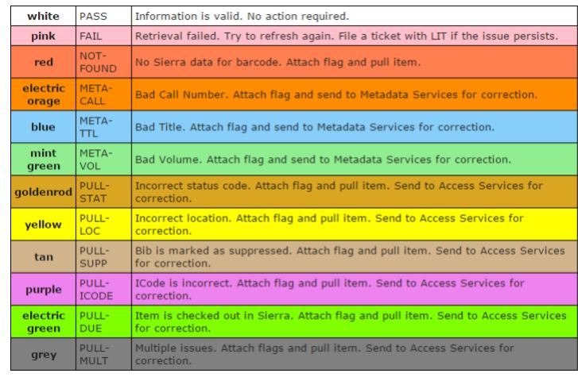

#HSLIDE
##A Single Page Web App to Inventory 900,000 Books!

### Terry Brady
### Georgetown University Library

- https://github.com/terrywbrady/info

#HSLIDE

### An inventory of 900,000 items in our stacks will take place before a library system (ILS) migration

#HSLIDE
### Possible actions on these 900,000 items
- No action required
- Re-shelve item - out of sequence
- Send to Metadata Services Staff for Correction
- Send to Access Services Staff for Correction

#HSLIDE
# Action Legend

#HSLIDE
### Step 1: Scanning
- Student Worker Opens Barcode Scanning Tool (PHP and JavaScript)
- Student Worker Scans Books with a Barcode Scanner
 - Barcode Is Sent to a Web Service (AJAX)
 - Barcode Lookup Occurs in ILS (PHP and PostgreSQL via Sierra DNA)
 - Catalog Data Is Returned 
- Web Page Refreshes with Catalog Data for the Last Item Scanned
 - Title, Call Number and Volume Display in Large Text

- If an error condition is retuned (item has due date, unexpected location, etc)
 - Item is pulled from shelf and a color coded note is added to the item
 - Item will be sent to Access Services to Resolve
- Student worker manually compares the Title, Call Number and Volume
 - Student worker clicks a button to set an error condition
 - Item is pulled from the shelf and a color coded note is added to the item
 - Item will be sent to Metadata Servies to Resolve

#HSLIDE
### Step 3: Evaluate Item Shelf Sequence
- The Call Number of each item is normalized
 - Our ILS should do this, but it is not reliable
 - We are using code from the University of Dayton to perform this step
- The Normalized call number is compared with the previously scanned item
- Items that appear out of sequence with the prior item are color coded
- Student worker will re-shelf if appropriate
 
#HSLIDE
### Step 4: Complete Scanning Session
- Student Worker Clicks Link to Save Work 
 - A CSV representation of the inventory session is sent to a web service (AJAX)
 - The Web Service parses the CSV and creates a Google Sheet (Google App Script)
  - A new sheet is created based on the starting and ending call numbers
  - CSV data fields are added to the Spreadsheet with all auto-formatting disabled
  - The link to the new spreadsheet is returned in a new tab

#HSLIDE
### Step 5: Evaluation and Bulk Update
- Library staff view a concatenated list of inventory files in Google Sheets
- Using a Google Sheets Add-On, items can be grouped by error condition or location
- Sierra (ILS) "Create Lists" are generated based on the grouping allowing bulk correction in the ILS

#HSLIDE
### Other Notes
- The inventory session is also saved to the browser database in case the user accidentally navigates away from the page
- A bulk data entry process is allowed if scans ever take place offline

#HSLIDE

#VSLIDE

#VHSLIDE

