# Post Inventory Analysis

The generated inventory files will be uploaded into Google Sheets.  A Google Sheet Add-On will be generated to support the analysis of the 
data and to facilitate the creation of Sierra Create List files.

[License Info](LICENSE.md)

## Installation of Add On
This add-on was built to support an inventory project at the Georgetown University Library.  The Add-On is available [here](https://chrome.google.com/webstore/detail/georgetown-library-invent/allalkpfmgndcgokflbmegganieinclk?utm_source=permalink).  It is unlikely to be useful outside of the context of this project.

### Select Add-On Menu
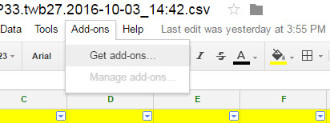

### Browse Georgetown Extensions
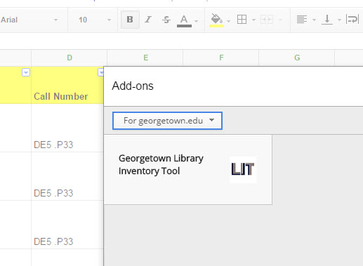

### Install the Add-On
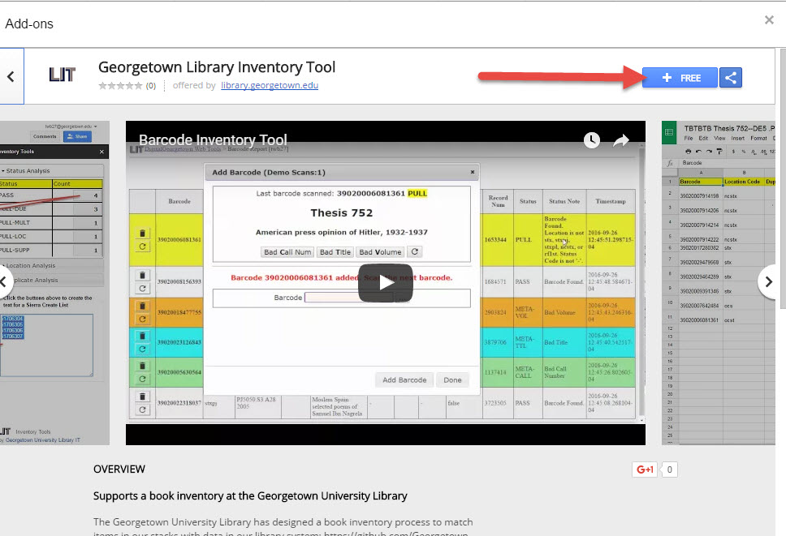

### Authorize the Add-On
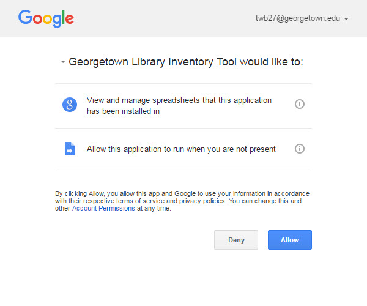

## Screen Shots

### Start Analysis

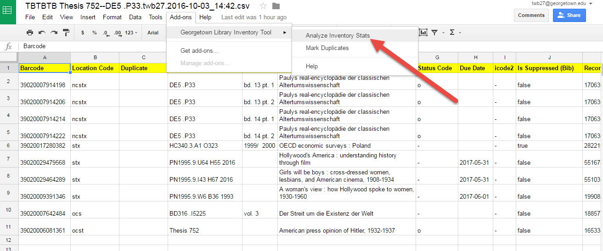

### Analysis Tab

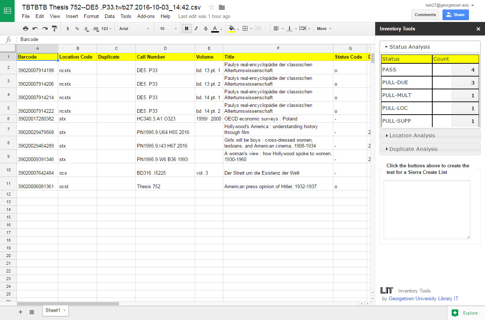

### Create a Sierra Create List Based on Status Value
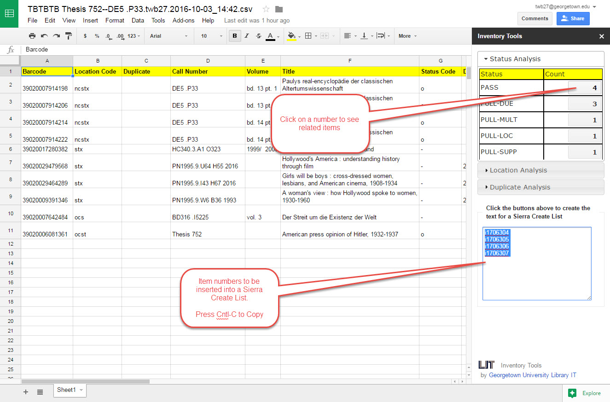

### View By Location Code
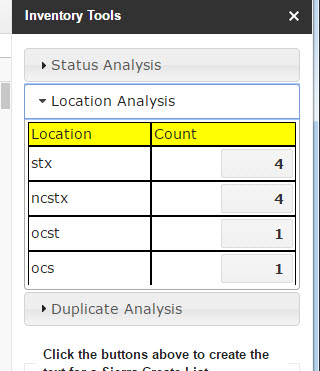

### Trigger Duplicate Barcode Analysis
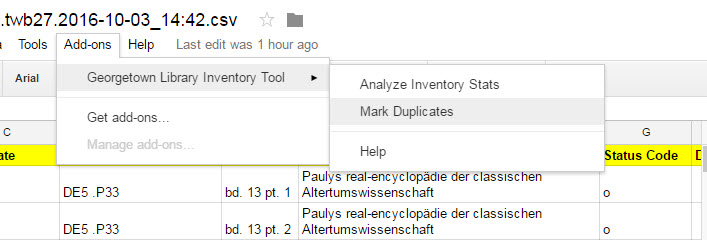

### View Duplicates
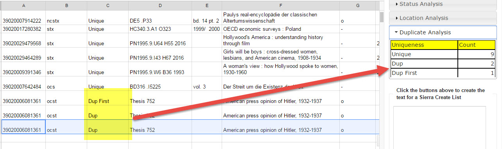

### Use Google Sheet Filters to Resolve Duplicates
Select all cells and then turn on Filters.
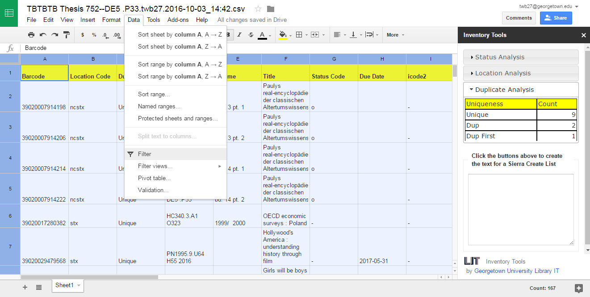

Filter for duplicate values and remove unwanted rows.
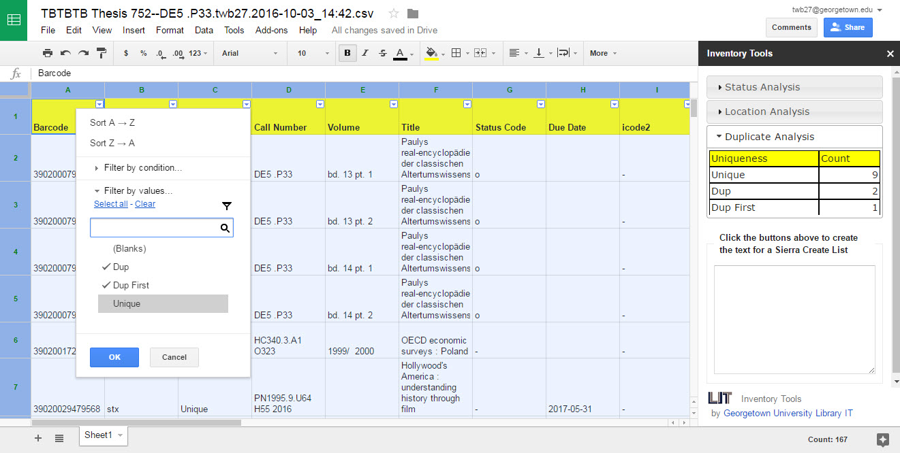
