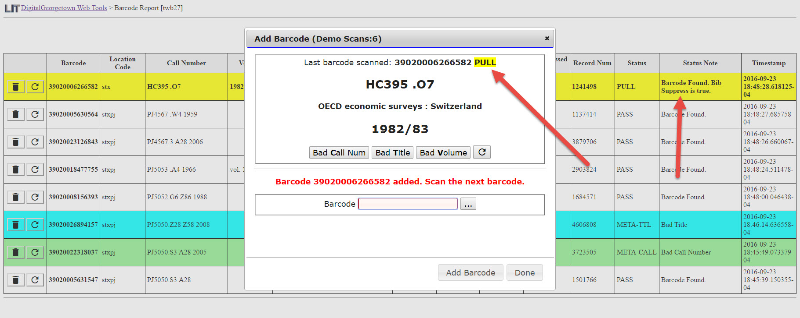

# BarcodeInventory
Support barcode scanning inventory process using data from Sierra.

Results are exported to Google Sheets using a service provided in the following project: https://github.com/Georgetown-University-Libraries/PlainTextCSV_GoogleAppsScript

## Demonstration Video
This video demonstrates a barcode scanning inventory workflow developed by the Georgetown University Library.  

## Description
* Access Services student works will scan a shelf of books into a web page.
* The response from the PHP Service returns a status: PASS, FAIL, PULL that indicates the action the student worker will take with the item that was scanned.
* The call number of the scanned item is compared to the previously scanned item.  Items out of sort order will be color coded.
* Student validates the Call Number, Title, and Volume on the book.  The student marks items with incorrect information.
* Items in error are pulled from shelves
* Scanning results are exported to Google Sheets.  Corrections are made into Sierra using these results.
* The table is cleared an a new scanning session is started. 

## BarcodeInventory Analysis Using Google Sheets

A Google Sheet Add-On has been developed to process the results of this inventory process.  That process is described [here](PostInventoryAnalysis.md).

#### Scanning Tool Using Google Sheets (Oboslete Code)
Intially, the barcode inventory tool was develoepd to run inside Google Sheets. This version of the process was abandoned due to poor performance.  The Code is available here: [GoogleSheets Code](gs/README.md)

## Credit
This project was inspired by a project from the University of Dayton Library: https://github.com/rayvoelker/2015RoeschLibraryInventory

This code uses a LC Call Number Sort module developed by Ray Voelker from the University of Dayton Library: https://github.com/rayvoelker/js-loc-callnumbers

***
[Georgetown University Library IT Code Repositories](http://georgetown-university-libraries.github.io/)
