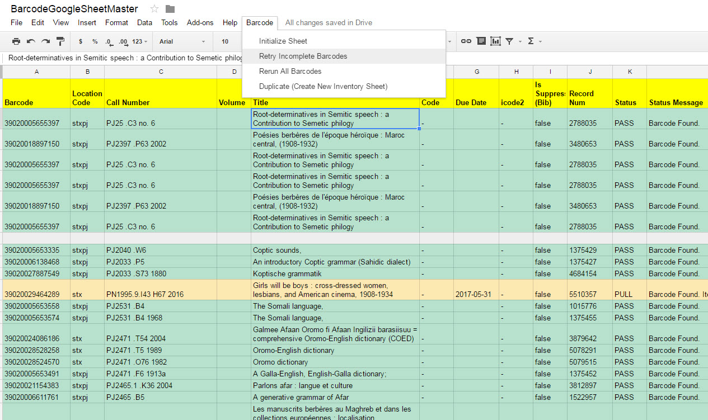

# BarcodeInventory (Google Sheets Version)
Support barcode inventory scanning into Google Sheets process using data from Sierra.

_This version of the process was abandoned due to poor performance._

## Demonstration Video (Google Sheets Version)
This video demonstrates a barcode scanning inventory workflow developed by the Georgetown University Library using Google Sheets.

## Description (Google Sheets Version)
* Access Services student works will scan a shelf of books in order into a Google Sheet containing Google Apps Script code.
* The Google Sheet has a trigger that marks the new barcode with a comment (onEdit function)
* A trigger fires (onChange) that looks for barcodes to be validated
* A call is made to a PHP web service that looks up barcode data using Sierra DNA
* The response from the PHP Service returns a status: PASS, FAIL, PULL that indicates the action the student worker will take with the item that was scanned.

## Credit
This project was inspired by a project from the University of Dayton Library: https://github.com/rayvoelker/2015RoeschLibraryInventory

***
[Georgetown University Library IT Code Repositories](http://georgetown-university-libraries.github.io/)
